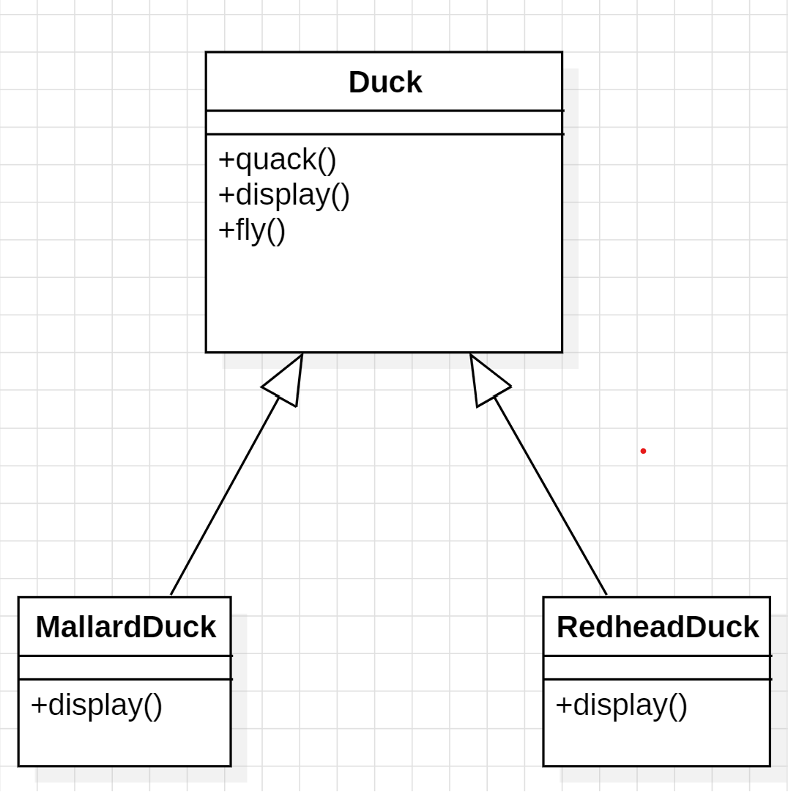

전략 패턴
==

<br>

Duck 클래스를 상속을 사용하는 두개의 클래스는 다음과 같다.
- MallardDuck은 날 수는 있지만, 목을 다쳐 울음소리를 낼 수 없다고 하자.
- RedheadDuck은 날 수도 있고, 울음소리를 낼 수 있다.

````java
public abstract class Duck {
    public void quack() {
        System.out.println("오리 꽥꽥.");
    }

    public void fly() {
        System.out.println("오리 날다.");
    }

    public abstract void display();
}

````
상속을 사용해서 MallardDuck, RedheadDuck을 구현했을 때 다음과 같은 문제가 발생한다.
- 상속을 받으면 안되는 메서드가 존재한다. ex) MallardDuck은 울음 소리를 낼 수없다.
- 이를 수정하기 위해 오버라이딩을 할 수 있다. 하지만, 누락하기 쉽고 중복되는 코드가 많아진다.


인터페이스를 통해 구현하면 서브 클래스에 메서드를 반드시 추가해야한다. 
이는, 요구사항이 변경하는 것이 어렵다는 것을 의미한다.

요약하면 2가지 문제가 존재한다.
- 상속은 모든 서브 클래스에 한가지 행위를 강제한다.
- 인터페이스는 구현 시 항상 코드를 구현해야 하는데, 

## 달라지는 부분을 찾아, 분리시키면 이 문제가 해결된다.

클래스마다 달라지는 부분을 따로 뽑아서 캡슐화하면 바뀌지 않는 부분에 영향을 미치지 않고 코드를 수정할 수 있게된다. 

## 구현보다 인터페이스(상위 형식)에 맞춰 프로그래밍
나는 행동과, 울음 소리를 내는 행동을 인터페이스로 나타내고 이를 가지고 있다면 실행 시 동적으로 해당 클래스의 행위를 변경할 수 있게 된다.

이렇게 바뀌는 부분을 추상화하여 알고리즘군으로 만들고, 이를 수정해서 사용할 수 있도록 해주는 **전략 패턴**을 활용하면 유연한 객체를 디자인할 수 있다. 