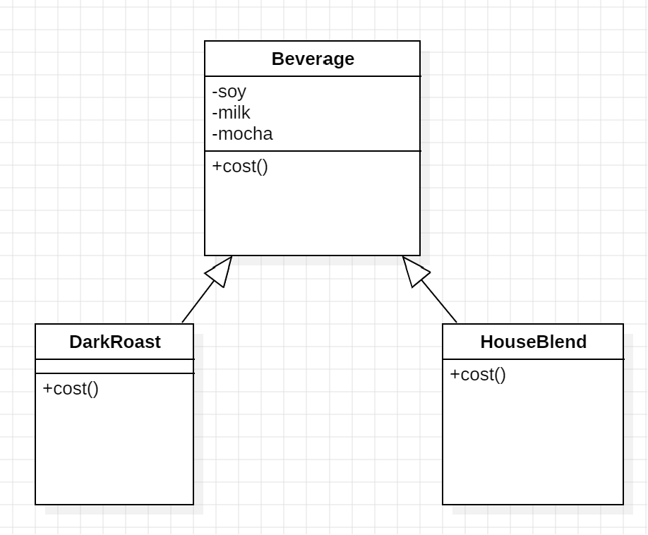

데코레이터 패턴
==
일상 속에서 커피를 주문하는 일은 빈번하게 일어난다. 
커피를 주문할 때, 다양한 첨가물을 첨가할 수 있는데 이때의 상황을 클래스 다이어그램으로 나타내면 다음과 같을 것이다.

- 두유나 밀크, 모카를 추가로 선택할 수 있고 그에 따른 가격이 결정된다.
- DarkRoast, HouseBlend가 있다고 가정하자.

이렇게 클래스를 구성할 때, 문제점은 첨가물이 추가될 때, 가격이 변경될 때 항상 코드를 수정해야한다.

### OCP
클래스는 변경에 닫혀있고, 확장에는 열려있어야 한다는 디자인 원칙
- ex) 