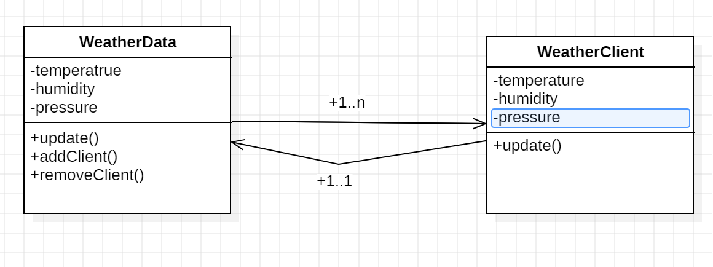
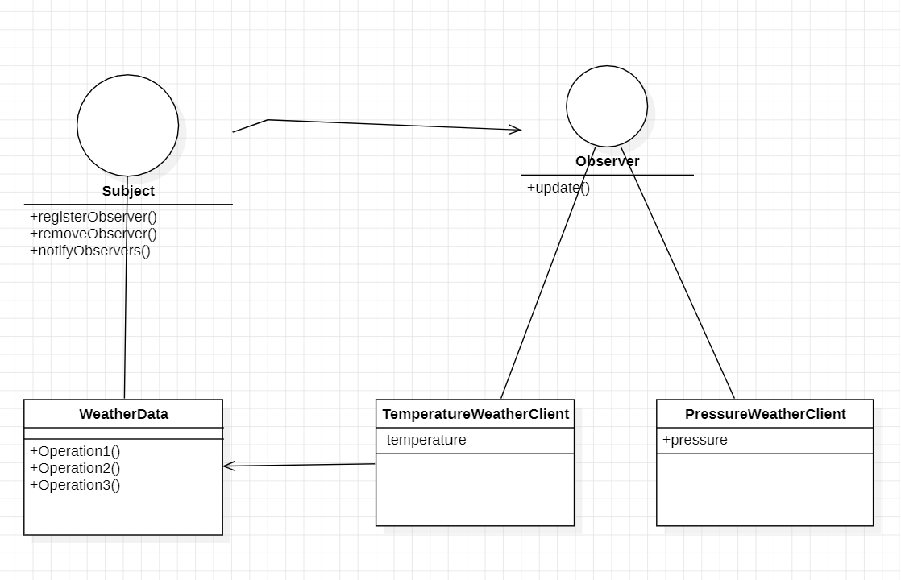

옵저버 패턴
==
**옵저버 패턴**은 한 객체의 상태가 바뀌면, 그 객체에 의존하는 다른 객체에 연락이 가고 자동으로 내용이 갱신되는 방식으로 one to many 의존성을 정의한다.
- Subject 클래스를 의존하고 있는 Observer 클래스가 존재하고 Subject 클래스의 상대가 변경되면 이를 의존하고 있는 Observer 클래스에 연락이 간다.
- 구독을 하면, 알람이 가는 방식으로 생각하면 된다.

날짜 데이터가 갱신될 때마다, 그에 관심을 갖는 클라이언트에게 메시지를 보내는 형태로 구성을 해보자.

날짜 데이터가 여러 개의 클라이언트를 관리하고 클라이언트는 맺고자 하는 서비스를 알고 있는 그림과 같은 일대다 관계가 맺어질 것이다.

여기서 문제점은 무엇일까?
- WeatherData가 WeatherClient 라는 구체적 클래스에 의존하고 있고, 그 반대 역시 마찬가지다.
- 그래서, WeatherClient가 아닌 다른 클래스가 해당 WeatherData를 알고 싶을 때 코드를 수정하는 하는 것을 피할 수 없다.
- WeatherClient와 관계를 맺는 부분을 추상화 하면 문제가 해결될 것 같다.

- WeatherData는 Subject 인터페이스를 구현해, 의존 관계를 맺고 있는 클라이언트가 동적으로 다른 주제의 데이터를 받을 수 있도록 구현
- WeatherClient도 Observer 인터페이스를 구현해, Subject는 Observer 인터페이스를 구현한 모든 클래스에 메시지를 보낼 수 있게 됐다.

이전과 다르게 구현 클래스들이 다른 구현 클래스에 의존하지 않게 됐다. 객체들이 느슨하게 결합돼 있어, 객체사이의 상호 의존성을 최소화 할 수 있다.

이처럼 객체들이 상호작용할 수 있지만, 서로를 잘 모르는 관계를 **느슨한 결합**이라고 한다.

가능하면 상호작용하는 객체 사이 느슨한 결합을 사용해야 한다.

느슨한 결합을 통해 얻는 장점은 다음과 같다.
- 더 이상 WeatherClient라는 구체적인 클래스에 의존하지 않고 Observer 인터페이스에 의존한다. 구현 클래스가 무엇인지 알 필요가 없다. 
- Subject나 Observer가 서로에게 영향을 미치지 않는다.